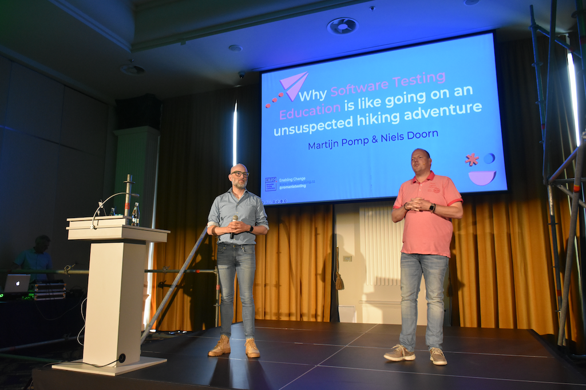

---
layout: post
title: "The Romanian Testing Conference"
date: 2023-06-06 09:00:00 +0200
categories: blog
tags: [conference, RTC, presentation]
...

# RTC 2023

Last year a colleague and I went to the Romanian Testing Conference 2022 in Cluj-Napoca, Romania. It was a two-day event, with one day of tutorials and one day of conference. We really enjoyed the event, and decided to come again this year. But this year, we are more involved, because RTC accepted our proposal for a presentation! So we get to present on the conference day. 

This year, it is a three-day event, with more time allocated for tutorials. We are attending two whole day tutorials on testing.

## Day 1: The Exploratory Testing That Catches Bugs! -- Tutorial by Peter Sabev

This tutorial was very interesting. Peter explained what exploratory testing is, what the pros and cons are, and how to do it.
He presented many approaches, tour-based, persona based and De Bono's thinking hats based approaches. It was a very hands-on tutorial, so we got to test a live production system very thoroughly using these approaches. The amount of issues we uncovered was huge.

I really liked the pair-testing way of working. One takes the role of observer and keeps a log of the testing session, and the driver does the testing. This way, both peers can focus on one thing and this reduces the need to keep on switching between testing and logging.

## Day 2: Back to basics tutorial

We attended this tutorial with the idea to see how we can improve our testing education. The idea behind the tutorial was good, however, the tutorial failed to convince in some ways. The concepts explained are relevant, however the examples given are somewhat controversial, and the sheets contained some critical errors.

## Day 3: Conference day!

Day three, the last day, is the conference day. In the afternoon is our presentation, before that lots of interesting talks and keynotes.

The first keynote speaker stated that testing is a form of technical leadership, which I like. He also talked about approaching testing in the same way as a doctor does a diagnosis. Something I am researching as well. His motive was that the people who pay for testing do not care about how we test, but at the result. If a doctor has a medicine, most patients want that medicine. This is different from my research perspective, but might be another reason to shift the teaching paradigm from the rational approach to the emperical approach.

The second talk is about improving the performance of end-to-end tests. Something not directly applicable for me, but interesting nonetheless. 

The third presentation is about nudging. Something I really like in education and in everyday live. The ideas to apply it in testing were very nicely presented, and the underlying theory was nicely connected. All in all a very interesting presentation.

The next presentation I really liked was about becoming a nice person to work with. It was based on improv theatre, and really interactive. It was about failing, and communicating clear intents. 

After that we attended a presentation about software failures that happened. It is always good to learn from mistakes others make, but it is also a good idea to keep a personal log of made mistakes to look back on in time.

)

Before the final keynote was our presentation. Based on the reactions during and afterwards from the audience, it was a success! We really enjoyed doing it. It was a good talk at the end of the day, when most people become overwhelmed with information. Our presentation was about the experience we had last year the day after RTC2022 when we went on a hiking adventure with a guide. During that hike we saw a lot of similarities with what we encountered during that hike and the way students learn software testing.