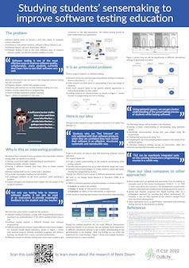
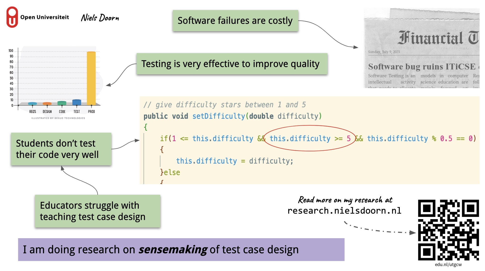

---
title: "Home"
...

## Niels Doorn, Ph.D. student in Computer Science Education (CSEd)

My name is Niels Doorn, I work at [NHL Stenden University of Applied Sciences](https://nhlstenden.com) as a team leader / lecturer / researcher at the Informatics program in Emmen, The Netherlands. I am a Ph.D. student at the [Open Universiteit](https://ou.nl). 

### Orcid

My Orcid ID is: [0000-0002-0680-4443](https://orcid.org/0000-0002-0680-4443).

### Twitter

I sometimes [tweet](https://www.twitter.com/nielsdoorn) about my research, but more often about other things that interest me or that fill me with wonder. 
I also maintain a surely incomplete [list](https://twitter.com/i/lists/1356482580627996672?s=20) of software testing research Twitter accounts.
If you know another Twitter account that should be on the list (maybe your own), send me a direct message.

## Focus of my research

Together with other researchers I want to improve the teaching of software testing in higher educational computer science programs. We believe that due to the ever gaining importance of software systems in our society, the quality of these systems need to be as high as possible. Of course, this is almost an impossible task given the nature and complexity of software systems. It is therefore important to pay attention to software testing education.

My research is in Computer Science Education to gain insights into students' sensemaking of test case design to be able to design a teaching-learning strategy that supports students to learn exploratory and model based software testing which:

- Works in different educational contexts
- Is integrable in existing courses
- Can be taught from the start of the program

In the end, all computer science graduates should be ["Test Infected"](http://junit.sourceforge.net/doc/testinfected/testing.htm), a term coined by Martin Fowler to describe the intrinsic motivation to not accepting untested software.

For this research, I am using Design Research in Education.

## Current work

Currently, I am working on:

- Studying the sensemaking approaches of students while modeling test cases
- Researching the effects of introducing testing early, seamlessly and in a subtle way in existing courses
- Designing experiments to understand misconceptions in testing by students
- Designing experiments to gain an initial insight in the possible effects of biases in testing

## Poster and presentation at ITiCSE 2022

You can find the PDF of my poster [here](Poster_ITiCSE.pdf).

And below is the slide for the presentation.

## Academic services

I find it important to contribute to our academic society. I am also looking at reviewing opportunities and guiding master students.

### Current work

Currently, I am participating in the following items:

- I will be lecturing a LaTeX course at Open Universiteit
- I am a member of the organizing committee of [NIOC 2023](http://nioc.nl).
- And one of the student competition chairs of [A-Test 2022](https://a-test.org/).

### Past work

Previously I have played an active role in the following items:

- I did a poster presentation at the inauguration of [Dr. Migchiel van Diggelen](https://www.nhlstenden.com/onderzoek/dr-migchiel-van-diggelen) (website in Dutch).
- And I was one of the two student volunteer chairs for the [15th IEEE International Conference on Software Testing, Verification and Validation (ICST) 2022](https://icst2022.vrain.upv.es/).

## Publications 

This is a list of my publications:

<bibtex src="mypublications.bib"></bibtex>

  

    

      <h3>Refereed Articles</h3>
      

        

      

    

    

      <h3>Books</h3>
      

        

      

    

    

      <h3>Conference and Workshop Papers</h3>
      

        

      

    

    

      <h3>Other Publications</h3>
      

        

      

    

  

