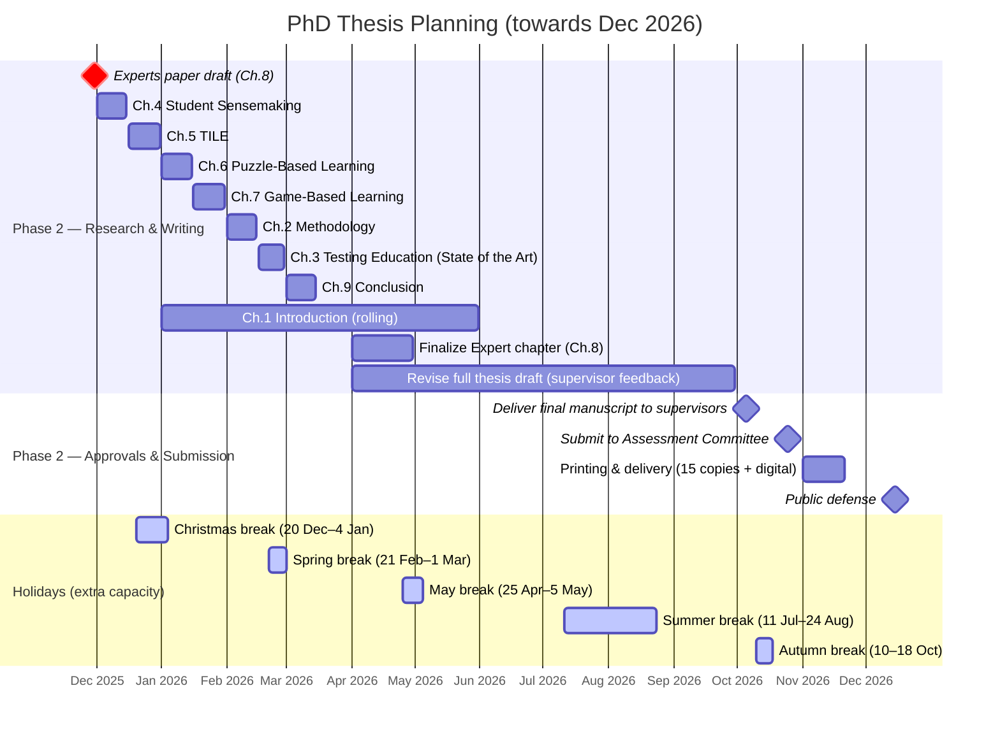

# PhD Planning – towards December 2026  

## Global planning

| Phase | Period | Activities | Status |
|-------|--------|------------|--------|
| **Phase 1 Orientation & Admission** | *Completed* | Admission to PhD trajectory, supervision agreement, initial research proposal | ✅ Finished |
| **Phase 2 Research & Writing** | Aug–Nov 2025 | Write and finalize *Experts paper* (RQ4) | ⏳ In progress |
|  | Dec 2025 – Mar 2026 | Integrate all published papers into thesis first draft (intro, methodology, connecting chapters) | Planned |
|  | April – Sep 2026 | Revise full thesis draft based on supervisors’ feedback | Planned |
|  | Oct 2026 | Deliver final manuscript to supervisors for approval | Planned |
|  | Oct 2026 | Submission to Assessment Committee after supervisor approval | Planned |
|  | Nov 2026 | Printing and delivery of 15 copies + digital version (≥ 3 weeks before defense) | Planned |
|  | Dec 2026 | Public defense of the dissertation | 🎯 Target |
| **Phase 3 – Formal Procedures** | After defense Dec 2026| Declaration of printing costs reimbursement | Planned | 

## Time Allocation
Allocated time per week: ~16 hours (2 workdays) up and until 1st of April 2026. After that, I will allocate spare time (e.g., 1 day per week) for thesis writing, as I will be working full-time at my job.
Extra time (e.g., holidays) can be allocated for writing.
List of holidays up and until December 2026:

- Autumn break: 18–26 Oct 2025 (9 days)
- Christmas break: 20 Dec 2025 – 4 Jan 2026 (16 days)
- Spring break: 21 Feb – 1 Mar 2026 (9 days)
- May break: 25 Apr – 5 May 2026 (11 days)
- Summer break: 11 Jul – 24 Aug 2026 (43 days)
- Autumn break: 10–18 Oct 2026 (9 days)

## Target for public defense

- Target date: December 2026 (exact date TBD based on committee availability)

## Planning Thesis

| Deadline       | Chapter(s) | Content | Holiday Boost |
|----------------|------------|---------|---------------|
| **30 Nov 2025** | Ch. 8 – Expert Sensemaking | Draft and submit expert paper (Wizard-of-Oz, epistemic games). | — |
| **15 Dec 2025** | Ch. 4 – Student Sensemaking | *Exploring students’ sensemaking* study. | — |
| **31 Dec 2025** | Ch. 5 – TILE | *ICST 2023 TILE paper* + GitHub updates. | 🎄 Christmas break (20 Dec – 4 Jan) → extra writing time |
| **15 Jan 2026** | Ch. 6 – Puzzle-Based Learning | *EASE Companion 2025* puzzle paper. | — |
| **31 Jan 2026** | Ch. 7 – Game-Based Learning | *ENASE 2025* BugOutbreak + INTED gamification. | — |
| **15 Feb 2026** | Ch. 2 – Methodology | Central RQs, epistemic games, WoZ, DBR, STGT. | 🌸 Spring break (21 Feb – 1 Mar) follows immediately |
| **29 Feb 2026** | Ch. 3 – Testing Education (State of the Art) | Literature (Garousi, Scatalon, ENACTEST, AI updates). | 🌸 Spring break overlap for deeper work |
| **15 Mar 2026** | Ch. 9 – Conclusion | Contributions, integration, implications for CS education & industry. | — |
| **30 Apr 2026** | Ch. 8 – Expert Sensemaking (finalized) | Incorporate reviewers’ feedback, align with thesis narrative. | 🌼 May break (25 Apr – 5 May) overlaps for finalization |
| **Jan–May 2026** | Ch. 1 – Introduction | Motivation, ENACTEST context, Bach vs. Bolton, RQs. | Supported by 🎄 Christmas, 🌸 Spring, 🌼 May breaks |
| **Jul–Aug 2026** | Full Thesis Revisions | Revise draft based on supervisor feedback. | ☀️ Summer break (11 Jul – 24 Aug) → intensive revisions |
| **Early Oct 2026** | Final Manuscript | Deliver to supervisors for approval. | 🍂 Autumn break (10–18 Oct) just before submission |
| **Late Oct 2026** | Submission | Submit to Assessment Committee. | 🍂 Autumn break overlap for polish |
| **Nov 2026** | Printing | Print & deliver 15 copies + digital. | — |
| **Dec 2026** | Defense | 🎯 Public defense of dissertation. | — |

### Gantt Chart Overview

## Planning Experts article

| Period | Tasks | Output |
|--------|-------|--------|
| **Week 1–2 (Aug–Sep 2025)** | Revisit research notes and HealthX data Outline article structure (Intro, Method, Results, Discussion) mapped to RQ4; Confirm target journal/conference (e.g., TOCE, STVR, ICSE, EASE, QRS, ITiCSE, Koli Calling) | Draft outline + target journal/conference |
| **Week 3–4 (Sep 2025)** | Write **Introduction & Related Work** (positioning: expert sensemaking, parallels with medicine/law, epistemic games) | First 2 sections complete |
| **Week 5–6 (Sep–Oct 2025)** | Write **Methodology** (Wizard-of-Oz setup, epistemic games framework, data collection/analysis) | Method section complete |
| **Autumn break (18–26 Oct 2025)** | Holiday break | Execute study wit experts and analyse results |
| **Week 7–8 (Oct 2025)** | Write **Results** (patterns, epistemic framing, tours, Socratic questioning) | Draft Results |
| **Week 9 (mid-Oct 2025)** | Write **Discussion** (implications for testing education, industry alignment) | Full first draft ready |
| **Week 10 (late Oct 2025)** | Circulate draft to supervisors for feedback | Feedback round |
| **Week 11–12 (Nov 2025)** | Revise based on feedback; Add figures/tables (risk tables, epistemic game diagram); Final polish (abstract, keywords, references) | Submission-ready draft |
| **30 Nov 2025** | Submit to chosen venue (TOCE) | ✅ Submission |